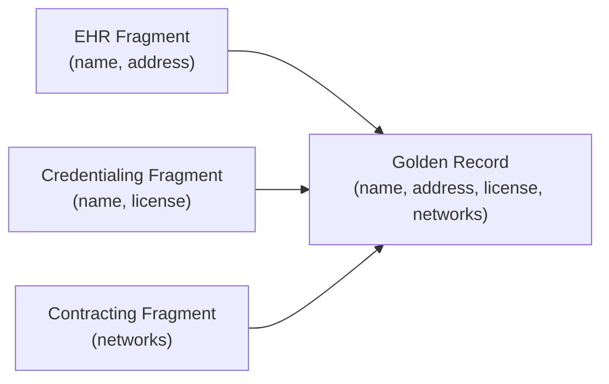

# Entity Resolution via Colimit

## The Problem

A single healthcare provider appears as partial, overlapping records in multiple systems. The EHR has name + address, credentialing has name + license, contracting has network memberships. How do you merge these into a single, deterministic golden record?

## Categorical Model

Entity resolution is a **colimit in the category $\mathbf{FinSet}/K$** — the category of finite sets indexed by a global key space $K$ (in our case, NPI numbers).

Each bounded context contributes a **fragment**: a finite set of records tagged with NPI keys. The colimit merges all fragments sharing the same key into a single combined record.



## Universal Property

The colimit satisfies a **universal property**: for any other merge target that receives maps from each fragment, there exists a unique mediating morphism from the colimit to that target. This means the colimit is the "most general" merge — every other valid merge factors through it.

In code, this is verified by `mediatingMorphism` and `canonicalInjection`.

## Code Walkthrough

### Creating fragments

Each bounded context produces a fragment using a constructor:

```typescript
import { ehrFragment, credentialingFragment, contractingFragment } from '@ddt-ct/implementation'

const ehr = ehrFragment('NPI-123', 'Dr. Jane Doe', { street: '100 Downtown Ave', ... })
const cred = credentialingFragment('NPI-123', 'Dr. Jane Doe', 'MD-98765')
const contract = contractingFragment('NPI-123', new Set(['BlueCross', 'Aetna']))
```

### Computing the colimit

`resolveProvider` computes the colimit of an array of fragments:

```typescript
import { resolveProvider } from '@ddt-ct/implementation'

const golden = resolveProvider([ehr, cred, contract])
// golden.records[0].value = { name: 'Dr. Jane Doe', address: {...}, license: 'MD-98765', networks: Set(['BlueCross', 'Aetna']) }
```

Under the hood, `colimitFragments` groups records by key and merges overlapping values using `mergeProviderRecords` (last-defined-wins for each optional field).

## Key Takeaway

Entity resolution isn't ad-hoc string matching — it's a **universal construction** with a formal uniqueness guarantee. The colimit in $\mathbf{FinSet}/K$ gives us deterministic, composable entity merging for free.
