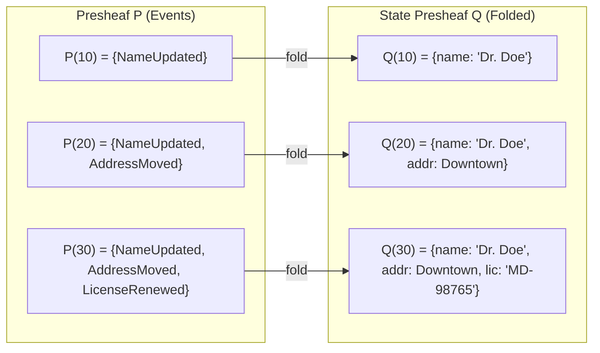

# Event Sourcing via Presheaf

## The Problem

Healthcare audits and regulatory inquiries often require answering: "What did Dr. Doe's record look like on March 15th?" Traditional CRUD databases overwrite previous state. Event sourcing preserves the full history, but how do you formalize the relationship between the event log and reconstructed state?

## Presheaf Model

The event log is a **presheaf** $P: T^{\mathrm{op}} \to \mathbf{Set}$ over the poset of time instants:

- $P(t)$ is the set of all events with timestamp $\leq t$ (the log prefix up to $t$)
- $P(s \leq t)$: the restriction map $P(t) \to P(s)$ truncates the log at $s$

State reconstruction is a **natural transformation** from the event-log presheaf to a state presheaf: it transforms "events up to t" into "state at t" in a way that commutes with restriction.



## Code Walkthrough

### Event log prefix

`eventLogUpTo` applies the presheaf to a time instant — it returns all events up to time $t$:

```typescript
import { eventLogUpTo } from '@ddt-ct/implementation'

const fullLog = [
  { timestamp: 10, payload: { type: 'NameUpdated', name: 'Dr. Jane Doe' } },
  { timestamp: 20, payload: { type: 'AddressMoved', address: downtown } },
  { timestamp: 30, payload: { type: 'LicenseRenewed', license: 'MD-98765', expiry: '2027-01-01' } }
]

const logAt20 = eventLogUpTo(fullLog, 20)
// [{ timestamp: 10, ... }, { timestamp: 20, ... }]
```

### State reconstruction

`foldEvents` folds the event log into state. `stateAt` composes the presheaf with the fold:

```typescript
import { foldEvents, stateAt } from '@ddt-ct/implementation'

const state = stateAt(fullLog, 20, initialState, applyEvent)
// State as of timestamp 20
```

For provider-specific usage, `foldProviderLog` handles the fold with deterministic timestamps:

```typescript
import { foldProviderLog } from '@ddt-ct/implementation'

const stateAt25 = foldProviderLog(eventLogUpTo(fullLog, 25))
```

### Snapshots

For large event logs, `snapshotStateAt` avoids replaying the entire history by resuming from the nearest periodic snapshot:

```typescript
import { createSnapshotLog, snapshotStateAt } from '@ddt-ct/implementation'

const slog = createSnapshotLog(events, initialState, applyEvent, 100)
const state = snapshotStateAt(slog, 250)
// Resumes from snapshot at t=200, folds only events in (200, 250]
```

`verifySnapshotEquivalence` proves the optimization is correct: `snapshotStateAt(t) === foldAll(t)` for every t.

## Key Takeaway

Event sourcing isn't just "append-only log" — it's a **presheaf over time** with state reconstruction as a natural transformation. This categorical framing gives us functoriality (restriction maps compose correctly) and a formal correctness criterion for the snapshot optimization.
